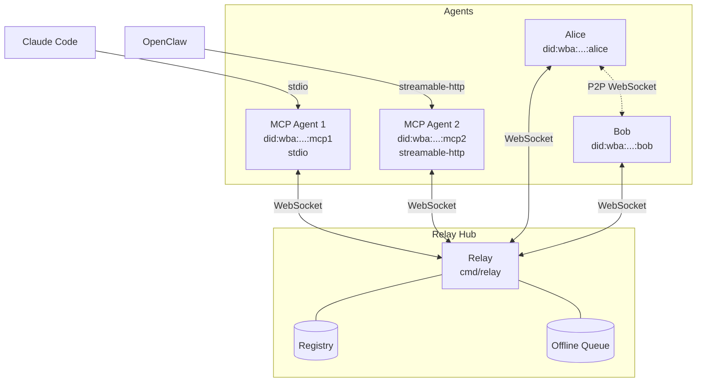

# msg2agent

The foundation for clear, secure, and verifiable communication between autonomous AI agents. Build decentralized agent networks with built-in identity, encryption, and interoperability.

## Features

- **Trustless Identity**: W3C DID-based agent identification (`did:wba:domain:agent:name`)
- **Secure Messaging**: End-to-end encryption with X25519-XChaCha20-Poly1305, Ed25519 signatures
- **Relay Hub**: Central message routing with WebSocket transport
- **A2A Protocol**: Google Agent-to-Agent protocol support for interoperability
- **MCP Integration**: Model Context Protocol adapter for AI assistant integration
- **Observability**: Prometheus metrics, OpenTelemetry tracing

## Architecture



See [Architecture docs](docs/architecture.md) for details.

## Use Cases

- **Secure Multi-Agent Systems**: Create coordinated swarms of agents that can work together securely without sharing private keys or relying on central authorities for trust.
- **Local-First AI Assistant Extensions**: Expose your local tools and services as agents that can be securely accessed by LLMs (via MCP) or other applications.
- **Decentralized Service Mesh**: Route messages between microservices/agents purely based on DIDs, decoupling identity from network location.
- **Cross-Organization Interoperability**: Allow agents from different organizations to communicate securely using standard protocols (DID, A2A).

## Quick Start

### Build

```bash
go build -o relay ./cmd/relay
go build -o agent ./cmd/agent
go build -o mcp-server ./cmd/mcp-server
```

### Run

```bash
# Terminal 1: Start relay
./relay -addr :8080

# Terminal 2: Start first agent
./agent -name alice -relay ws://localhost:8080

# Terminal 3: Start second agent
./agent -name bob -relay ws://localhost:8080

# Terminal 4 (optional): Start MCP server for Claude Desktop / OpenClaw
./mcp-server -name my-agent -relay ws://localhost:8080 -transport streamable-http -addr :3001
```

See the [Getting Started Guide](docs/getting-started.md) for a complete walkthrough.

## Documentation

| Document                                              | Description                             |
| ----------------------------------------------------- | --------------------------------------- |
| [Getting Started](docs/getting-started.md)            | Build, run, and send your first message |
| [Architecture](docs/architecture.md)                  | System design and core concepts         |
| [Configuration](docs/operations/configuration.md)     | All configuration options               |
| [API Reference](docs/api/jsonrpc.md)                  | JSON-RPC methods and protocols          |
| [Deployment](docs/deployment/)                        | Docker, Kubernetes, TLS setup           |
| [Monitoring](docs/operations/monitoring.md)           | Prometheus, Grafana, tracing            |
| [Troubleshooting](docs/operations/troubleshooting.md) | Common issues and solutions             |
| [OpenClaw Plugin](docs/openclaw-plugin/README.md)     | OpenClaw integration via MCP            |
| [Glossary](docs/glossary.md)                          | Term definitions                        |

## Project Structure

```
cmd/
  agent/          # Agent binary
  relay/          # Relay hub binary
  mcp-server/     # MCP protocol adapter
pkg/
  agent/          # Agent implementation
  config/         # Configuration helpers
  conversation/   # Threaded conversation storage
  crypto/         # Encryption and signing
  identity/       # DID management
  mcp/            # MCP server core (tools, resources, inbox)
  messaging/      # Message types and routing
  protocol/       # JSON-RPC wire protocol
  queue/          # Offline message queueing (store-and-forward)
  registry/       # Agent storage (memory, file, SQLite)
  security/       # Access control lists
  transport/      # WebSocket, stdio, SSE transports
  telemetry/      # Metrics and tracing
adapters/
  a2a/            # A2A protocol adapter
  mcp/            # MCP protocol adapter
infrastructure/   # Terraform configurations
scripts/          # Development/deployment/scenario scripts
test/             # Integration and E2E tests
docker-compose*.yml  # Docker Compose configurations
```

## Requirements

- Go 1.24+
- Docker (optional, for containerized deployment)

## License

Apache 2.0 - See [LICENSE](LICENSE) for details.
