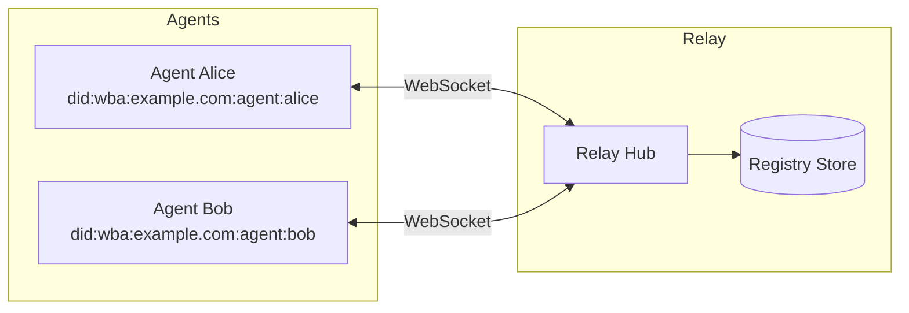
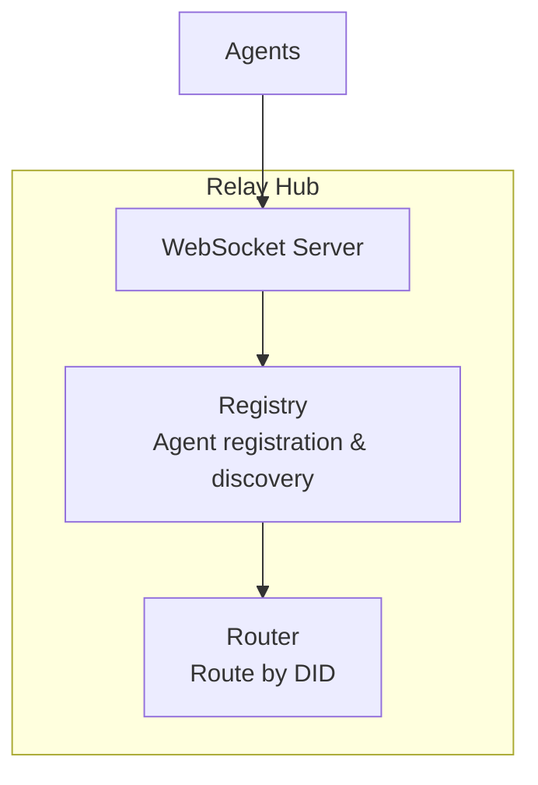
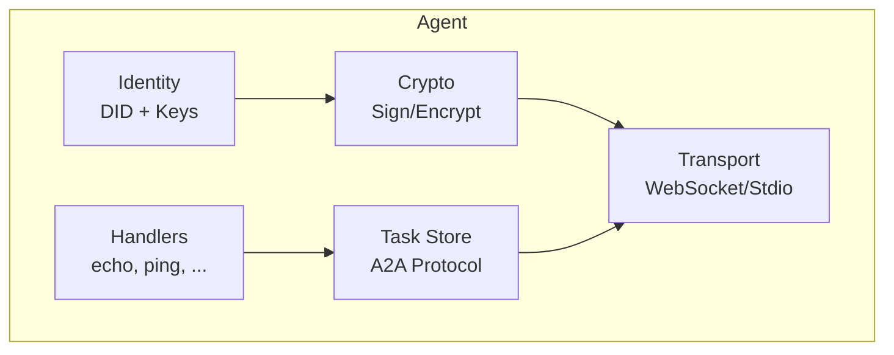
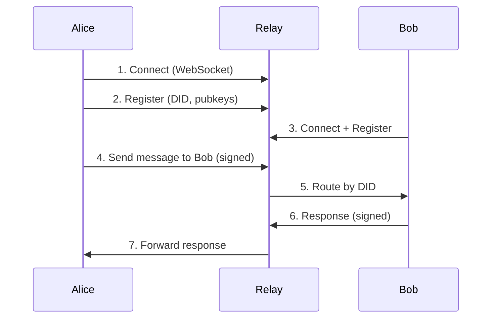
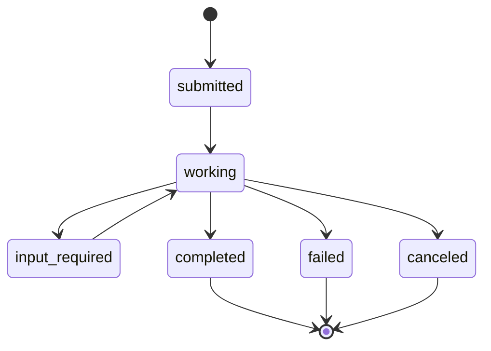
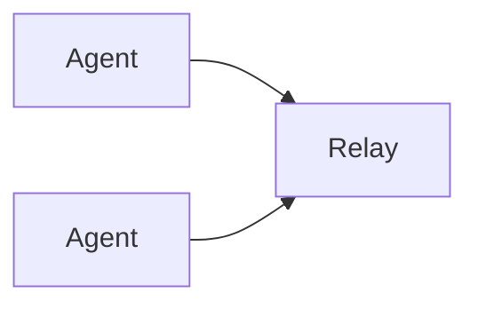
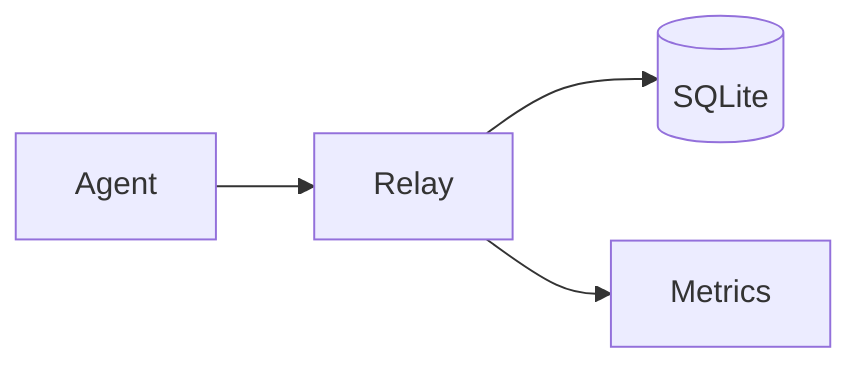
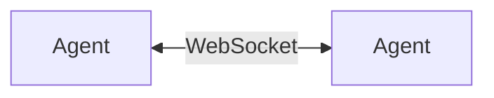

# Architecture

This document describes the msg2agent system architecture, core concepts, and design decisions.

## Overview

msg2agent is a secure agent communication framework that enables agents to discover each other and exchange messages through a central relay hub or direct peer-to-peer connections.



## Core Concepts

### Decentralized Identifier (DID)

Each agent has a unique W3C DID that serves as its identity:

```
did:wba:example.com:agent:alice
 |   |       |        |     |
 |   |       |        |     +-- Agent name
 |   |       |        +-------- "agent" path segment
 |   |       +----------------- Domain
 |   +------------------------- Method (Web-Based Agent)
 +----------------------------- DID scheme
```

The DID resolves to a DID Document containing:

- Public keys for signature verification (Ed25519)
- Public keys for encryption (X25519)
- Service endpoints for communication

### Agent Card

An agent card is a JSON document describing an agent's capabilities, served at `/.well-known/agent.json`:

```json
{
  "name": "alice",
  "url": "https://example.com/.well-known/agent.json",
  "version": "1.0.0",
  "capabilities": {
    "streaming": true,
    "pushNotifications": false,
    "stateTransitionHistory": true
  },
  "skills": [
    {
      "id": "echo",
      "name": "Echo",
      "description": "Echoes messages back"
    }
  ]
}
```

### DIDComm Messaging

Messages are wrapped in DIDComm envelopes:

```json
{
  "id": "unique-message-id",
  "type": "https://didcomm.org/basicmessage/2.0/message",
  "from": "did:wba:example.com:agent:alice",
  "to": ["did:wba:example.com:agent:bob"],
  "created_time": 1706180400,
  "body": { ... }
}
```

The body contains a JSON-RPC 2.0 request or response.

## Components

### Relay Hub

The relay is the central message router:



Responsibilities:

- Accept WebSocket connections from agents
- Register agents in the registry
- Route messages to target agents by DID
- Provide agent discovery
- Rate limiting and access control

Storage backends:

- **Memory**: In-memory, non-persistent (development)
- **File**: JSON file persistence (simple deployments)
- **SQLite**: SQL database with WAL mode (production)

### Agent

An agent is an autonomous entity that:



Responsibilities:

- Maintain identity (DID and cryptographic keys)
- Register method handlers for incoming requests
- Connect to relay or listen for P2P connections
- Sign outgoing messages (Ed25519)
- Encrypt messages when required (X25519-XChaCha20-Poly1305)
- Manage A2A protocol tasks

### Transport Layer

Pluggable transports abstract the communication channel:

| Transport | Use Case                     |
| --------- | ---------------------------- |
| WebSocket | Relay and P2P connections    |
| Stdio     | MCP protocol integration     |
| SSE       | Server-Sent Events streaming |

## Message Flow

### Request-Response



### A2A Task Flow

The A2A protocol supports long-running tasks with state transitions:



## Security Model

### Cryptographic Keys

Each agent has two key pairs:

| Key Type   | Algorithm | Purpose                      |
| ---------- | --------- | ---------------------------- |
| Signing    | Ed25519   | Message authentication       |
| Encryption | X25519    | Key agreement for encryption |

### Message Security

1. **Signing**: All messages are signed with the sender's Ed25519 private key
2. **Verification**: Recipients verify signatures using the sender's public key from their DID Document
3. **Encryption** (optional): Message bodies can be encrypted using X25519-XChaCha20-Poly1305

### Access Control

Agents can define ACL policies:

```json
{
  "default": "deny",
  "rules": [
    {
      "principal": "did:wba:example.com:agent:*",
      "actions": ["echo", "ping"],
      "effect": "allow"
    }
  ]
}
```

## Protocol Adapters

### A2A (Agent-to-Agent)

Google's A2A protocol for agent interoperability:

- Task-based interaction model
- Streaming support
- Agent card discovery

### MCP (Model Context Protocol)

Integration with AI assistants:

- Exposes agent functionality as MCP tools and resources
- Transports: **stdio** (Claude Code CLI), **streamable-http** (OpenClaw plugin, web clients), **SSE** (streaming)
- Tools: `list_agents`, `send_message`, `get_agent_info`, `get_self_info`, etc.
- Resources: `msg2agent://inbox`, `msg2agent://tasks` for inbox and task state
- Inbox: incoming messages are buffered and accessible via tools and resources

The [OpenClaw plugin](openclaw-plugin/README.md) is the reference MCP client integration:

```
OpenClaw → msg2agent Plugin → MCP HTTP → MCP Server → Agent → Relay → Network
```

## Supporting Components

### Offline Message Queue (`pkg/queue`)

Store-and-forward for agents that are temporarily offline:

- Messages are queued with a configurable TTL
- Delivered automatically when the agent reconnects
- Backends: in-memory (development), SQLite (production)
- Expired messages are cleaned up periodically

### Conversation Threading (`pkg/conversation`)

Threaded conversation storage:

- `Thread` and `Message` types for organizing conversations
- Messages are grouped by `thread_id` with sequence ordering
- Nested replies via `parent_id`
- Backends: in-memory, SQLite

### Presence and Channels

The relay hub includes:

- **Presence Manager**: tracks agent online status (`online`, `offline`, `busy`, `away`, `dnd`), supports pub/sub presence notifications and typing indicators
- **Channel Manager**: group messaging channels with `group`, `broadcast`, and `topic` types, member management, and sender key distribution for E2E encryption

## Deployment Patterns

### Single Relay

Simplest deployment for development and small teams:



### Relay with Persistence

Production deployment with SQLite:



### Direct P2P

Agents can also connect directly without a relay:



## Further Reading

- [Configuration Guide](operations/configuration.md)
- [JSON-RPC API Reference](api/jsonrpc.md)
- [Glossary](glossary.md)
