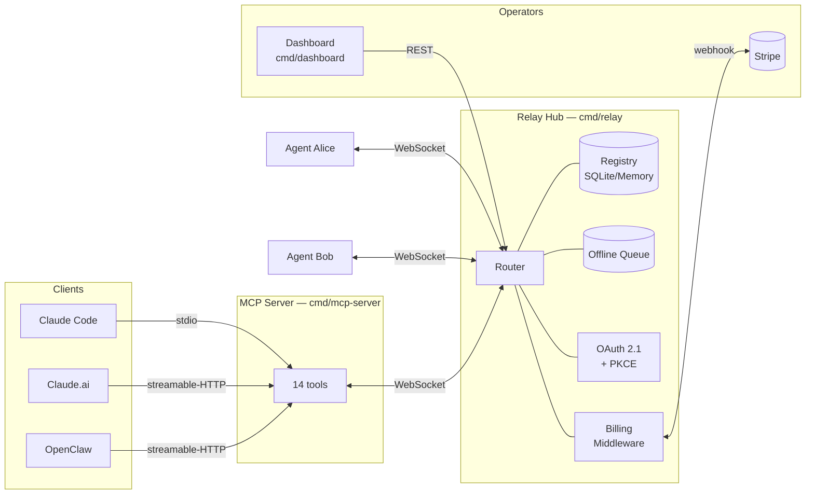
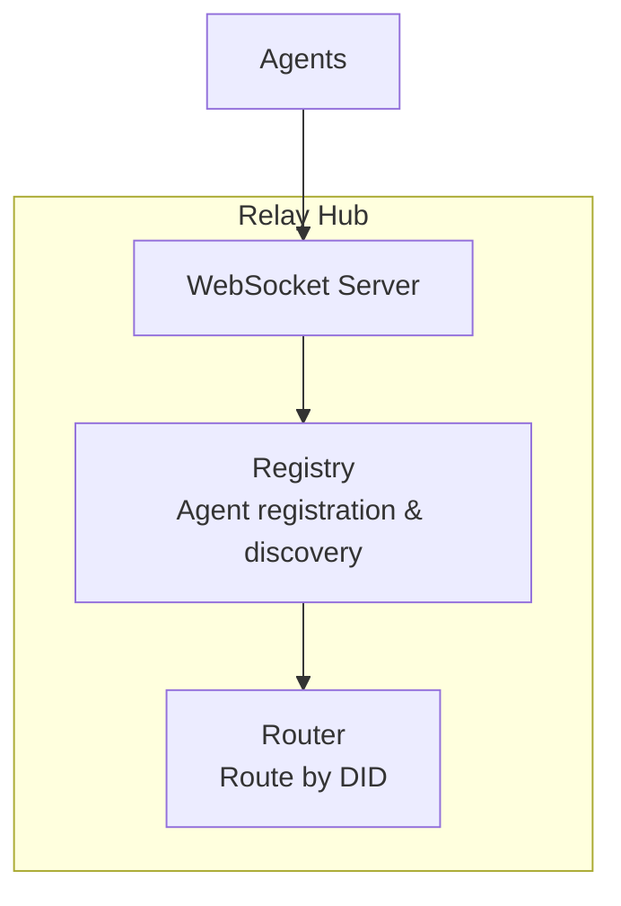
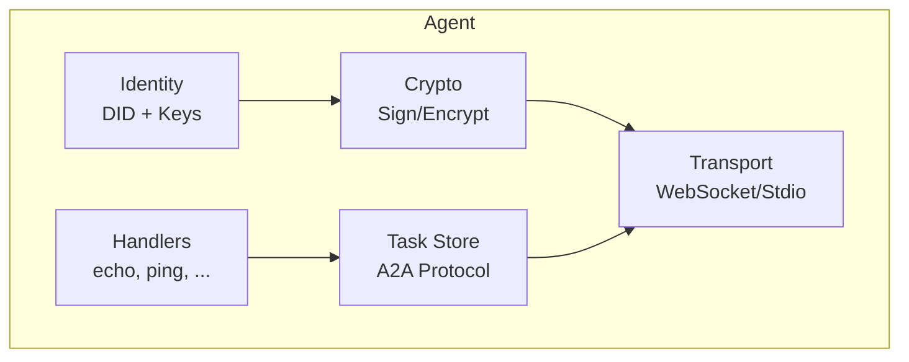
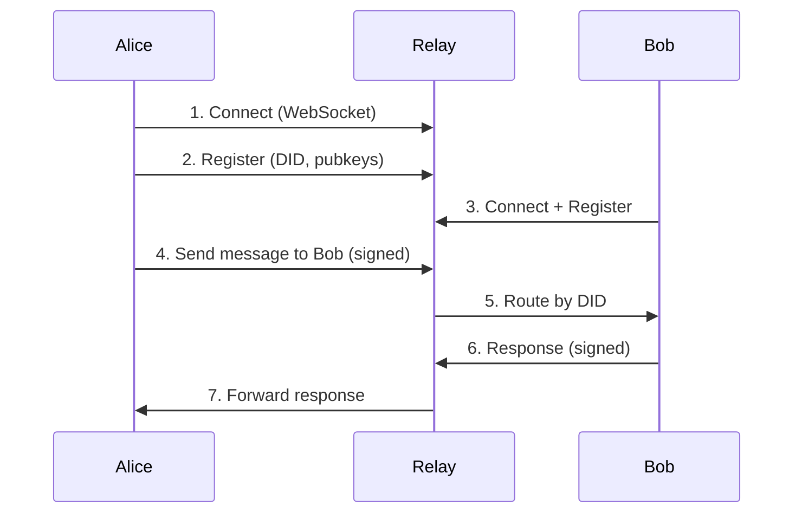
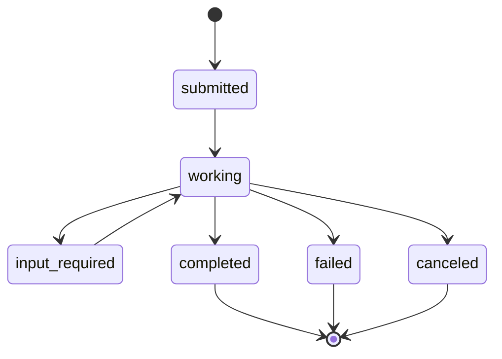
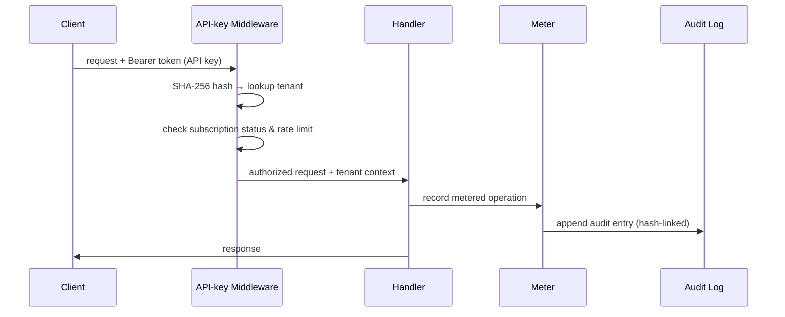
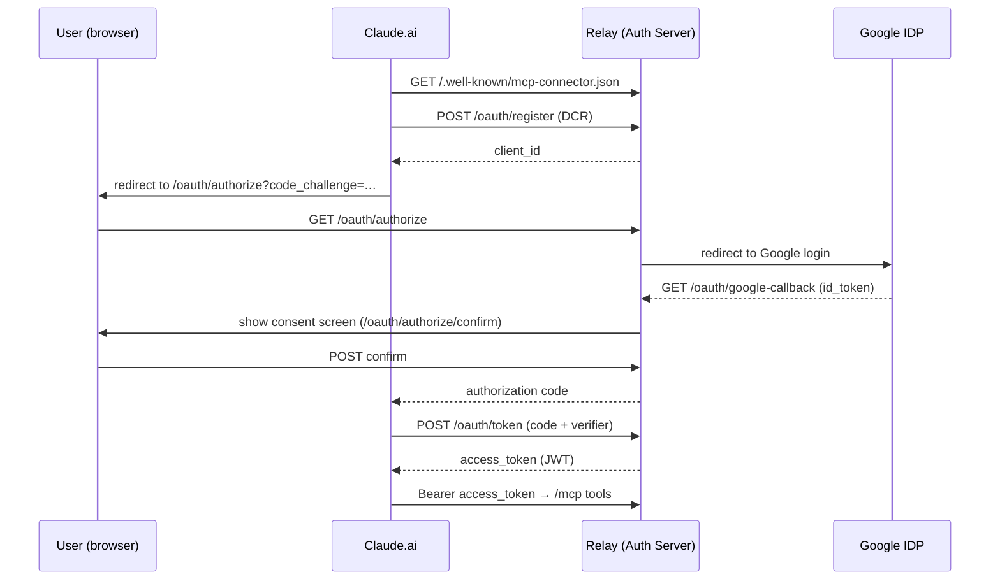
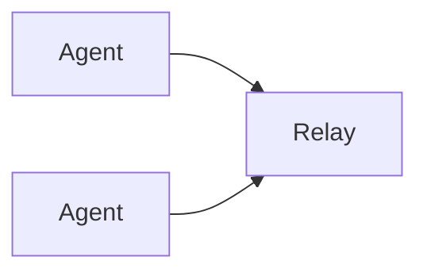
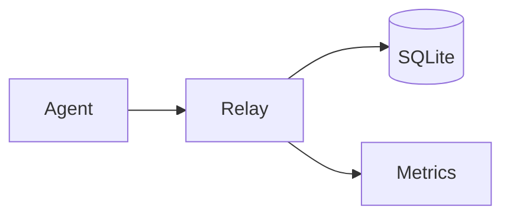
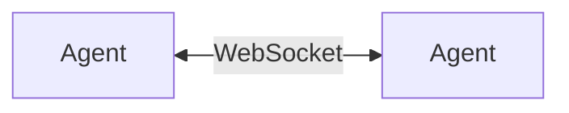

# Architecture

This document describes the msg2agent system architecture, core concepts, and design decisions.

## Overview

msg2agent is a secure agent communication framework that enables agents to discover each other and exchange messages through a central relay hub or direct peer-to-peer connections.



## Core Concepts

### Decentralized Identifier (DID)

Each agent has a unique W3C DID that serves as its identity:

```
did:wba:example.com:agent:alice
 |   |       |        |     |
 |   |       |        |     +-- Agent name
 |   |       |        +-------- "agent" path segment
 |   |       +----------------- Domain
 |   +------------------------- Method (Web-Based Agent)
 +----------------------------- DID scheme
```

The DID resolves to a DID Document containing:

- Public keys for signature verification (Ed25519)
- Public keys for encryption (X25519)
- Service endpoints for communication

### Agent Card

An agent card is a JSON document describing an agent's capabilities, served at `/.well-known/agent.json`:

```json
{
  "name": "alice",
  "url": "https://example.com/.well-known/agent.json",
  "version": "1.0.0",
  "capabilities": {
    "streaming": true,
    "pushNotifications": false,
    "stateTransitionHistory": true
  },
  "skills": [
    {
      "id": "echo",
      "name": "Echo",
      "description": "Echoes messages back"
    }
  ]
}
```

### DIDComm Messaging

Messages are wrapped in DIDComm envelopes:

```json
{
  "id": "unique-message-id",
  "type": "https://didcomm.org/basicmessage/2.0/message",
  "from": "did:wba:example.com:agent:alice",
  "to": ["did:wba:example.com:agent:bob"],
  "created_time": 1706180400,
  "body": { ... }
}
```

The body contains a JSON-RPC 2.0 request or response.

## Components

### Relay Hub

The relay is the central message router:



Responsibilities:

- Accept WebSocket connections from agents
- Register agents in the registry
- Route messages to target agents by DID
- Provide agent discovery
- Rate limiting and access control
- API-key authentication and plan enforcement (`pkg/billing/middleware.go`)
- Stripe checkout/portal and webhook processing (`cmd/relay/stripe_checkout.go`, `stripe_webhook.go`)
- Hash-linked audit chain for billing events (`pkg/billing/store.go` (`VerifyAuditChain`) + `pkg/billing/audit_verifier.go`)
- Self-serve tenant signup and email verification (`cmd/relay/signup.go`, `verify_email.go`)
- OAuth 2.1 + PKCE authorization server (`pkg/oauth/`)

Storage backends:

- **Memory**: In-memory, non-persistent (development/testing)
- **SQLite**: WAL-mode database for registry, queue, conversations, and billing (production default)
- **Postgres**: Billing store only — see [billing-postgres.md](operations/billing-postgres.md)

### Agent

An agent is an autonomous entity that:



Responsibilities:

- Maintain identity (DID and cryptographic keys)
- Register method handlers for incoming requests
- Connect to relay or listen for P2P connections
- Sign outgoing messages (Ed25519)
- Encrypt messages when required (X25519-XChaCha20-Poly1305)
- Manage A2A protocol tasks

### Transport Layer

Pluggable transports abstract the communication channel:

| Transport       | Use Case                                      |
| --------------- | --------------------------------------------- |
| WebSocket       | Relay and P2P connections                     |
| Stdio           | MCP protocol (Claude Code CLI)                |
| Streamable-HTTP | MCP protocol (Claude.ai, OpenClaw, web)       |
| SSE             | Server-Sent Events streaming                  |
| TLS (WSS)       | Encrypted WebSocket for production deployments |

## Message Flow

### Request-Response



### A2A Task Flow

The A2A protocol supports long-running tasks with state transitions:



## Security Model

### Cryptographic Keys

Each agent has two key pairs:

| Key Type   | Algorithm | Purpose                      |
| ---------- | --------- | ---------------------------- |
| Signing    | Ed25519   | Message authentication       |
| Encryption | X25519    | Key agreement for encryption |

### Message Security

1. **Signing**: All messages are signed with the sender's Ed25519 private key
2. **Verification**: Recipients verify signatures using the sender's public key from their DID Document
3. **Encryption** (optional): Message bodies can be encrypted using X25519-XChaCha20-Poly1305

### Access Control

Agents can define ACL policies:

```json
{
  "default": "deny",
  "rules": [
    {
      "principal": "did:wba:example.com:agent:*",
      "actions": ["echo", "ping"],
      "effect": "allow"
    }
  ]
}
```

## Protocol Adapters

### A2A (Agent-to-Agent)

Google's A2A protocol for agent interoperability:

- Task-based interaction model
- Streaming support
- Agent card discovery

### MCP (Model Context Protocol)

Integration with AI assistants via `cmd/mcp-server/` backed by `pkg/mcp/` (transport-independent server library):

- Transports: **stdio** (Claude Code CLI), **streamable-HTTP** (Claude.ai, OpenClaw, web clients), **SSE**
- **14 tools**: `list_agents`, `send_message`, `get_agent_info`, `get_task_status`, `query_capabilities`, `get_self_info`, `submit_task`, `cancel_task`, `send_task_input`, `list_tasks`, `list_messages`, `read_message`, `delete_message`, `message_count`
- Resources: `msg2agent://inbox`, `msg2agent://tasks` for inbox and task state
- Metered operations: `send_message` and `submit_task` count against the tenant's plan quota

The [OpenClaw plugin](openclaw-plugin/README.md) is the reference MCP client integration:

```
OpenClaw → msg2agent Plugin → MCP HTTP → MCP Server → Agent → Relay → Network
```

## Supporting Components

### Offline Message Queue (`pkg/queue`)

Store-and-forward for agents that are temporarily offline:

- Messages are queued with a configurable TTL
- Delivered automatically when the agent reconnects
- Backends: in-memory (development), SQLite (production)
- Expired messages are cleaned up periodically

### Conversation Threading (`pkg/conversation`)

Threaded conversation storage:

- `Thread` and `Message` types for organizing conversations
- Messages are grouped by `thread_id` with sequence ordering
- Nested replies via `parent_id`
- Backends: in-memory, SQLite

### Presence and Channels

The relay hub includes:

- **Presence Manager**: tracks agent online status (`online`, `offline`, `busy`, `away`, `dnd`), supports pub/sub presence notifications and typing indicators
- **Channel Manager**: group messaging channels with `group`, `broadcast`, and `topic` types, member management, and sender key distribution for E2E encryption

## Multi-Tenancy & Billing

The relay ships a full multi-tenant billing stack built around Stripe and an append-only audit chain.

### Tenant model

Each tenant maps to a Stripe customer and owns one or more API keys:

```
Tenant (pkg/billing/tenant.go)
 ├── TenantDID  (pkg/billing/tenant_did.go)  — did:wba identity for the tenant
 ├── APIKey[]   (pkg/billing/apikey.go)      — hashed keys with plan & expiry
 └── Subscription                             — Stripe subscription + status
```

### Request lifecycle



### Stripe lifecycle

1. **Checkout** — `POST /api/billing/checkout` creates a Stripe Checkout Session and redirects the tenant to Stripe (`cmd/relay/stripe_checkout.go`)
2. **Webhook** — `POST /api/billing/webhook` processes Stripe events (`invoice.paid`, `customer.subscription.*`) and updates the subscription state machine (`cmd/relay/stripe_webhook.go`, `pkg/billing/stripe_handlers.go`)
3. **Portal** — `POST /api/billing/portal` opens the Stripe Customer Portal for plan changes and payment updates
4. **Meter/Reconciler** — `pkg/billing/meter.go` counts metered calls; `reconciler.go` periodically syncs usage to Stripe

### Audit chain

Every billing mutation (key creation, plan change, invoice event) is appended to a hash-linked log (`pkg/billing/store.go` (`VerifyAuditChain`) + `pkg/billing/audit_verifier.go`). The chain can be verified offline:

```bash
./billing-admin verify-audit
```

Runbook for tampering detection: [operations/audit-incident-response.md](operations/audit-incident-response.md).

Storage: SQLite by default; migrate to Postgres for high availability — see [operations/billing-postgres.md](operations/billing-postgres.md).

---

## OAuth 2.1 + PKCE

The relay acts as an OAuth 2.1 Authorization Server enabling Claude.ai and other clients to authenticate users without sharing API keys.



Key endpoints (`pkg/oauth/`):

| Endpoint | Description |
| -------- | ----------- |
| `GET /.well-known/oauth-authorization-server` | AS metadata (RFC 8414) |
| `GET /.well-known/jwks.json` | JSON Web Key Set |
| `POST /oauth/register` | Dynamic Client Registration (RFC 7591) |
| `GET /oauth/authorize` | Authorization endpoint with PKCE |
| `GET /oauth/google-callback` | Google IDP callback |
| `POST /oauth/authorize/confirm` | Consent confirmation |
| `POST /oauth/token` | Token endpoint |
| `POST /oauth/revoke` | Token revocation (RFC 7009) |

The connector manifest at `/.well-known/mcp-connector.json` (built from `infrastructure/connector-manifest.json`) is the entry point for Claude.ai's one-click connector installation.

---

## Dashboard & Operator API

`cmd/dashboard/` is a standalone binary that exposes a REST API and serves the operator SPA (`web/src/pages/app/`).

Authentication: OAuth 2.1 Bearer JWT validated by `cmd/dashboard/middleware.go`.

REST API (`cmd/dashboard/api.go`):

| Route | Methods | Description |
| ----- | ------- | ----------- |
| `/api/dashboard/me` | `GET` | Current tenant info |
| `/api/dashboard/keys` | `GET`, `POST` | List / create API keys |
| `/api/dashboard/keys/{id}` | `GET`, `PUT`, `DELETE` | Manage a single key |
| `/api/dashboard/usage` | `GET` | Usage stats (period filter) |
| `/api/dashboard/checkout` | `POST` | Start Stripe Checkout |
| `/api/dashboard/portal` | `POST` | Open Stripe Portal |

For deployment and configuration see [deployment/dashboard.md](deployment/dashboard.md).

---

## Email & Signup

Self-serve onboarding without manual provisioning:

1. `POST /api/tenants` — creates a tenant, sends a verification email (`cmd/relay/signup.go`, `pkg/email/`)
2. `GET /oauth/verify?token=…` — validates the email token, activates the tenant (`cmd/relay/verify_email.go`)
3. `POST /api/email/resend` — resends the verification link (`cmd/relay/email_resend.go`)

`pkg/email/` abstracts the mail provider so any SMTP/transactional-email backend can be plugged in.

---

## Observability

### Metrics

The relay and MCP server expose a Prometheus `/metrics` endpoint. Key metric families:

| Family | Source | Description |
| ------ | ------ | ----------- |
| `relay_messages_total` | `cmd/relay/metrics.go` | Messages routed by method |
| `relay_connections_active` | relay | Active WebSocket connections |
| `relay_queue_depth` | relay | Offline queue depth |
| `billing_api_requests_total` | `pkg/billing/metrics.go` | API calls by plan and status |
| `billing_metered_ops_total` | billing | Metered operations (send/submit) |

Full table: [operations/monitoring.md](operations/monitoring.md). Grafana dashboards: `infrastructure/grafana/billing-dashboard.json` — import instructions in [operations/grafana-setup.md](operations/grafana-setup.md).

### Tracing

OpenTelemetry tracing is configured in `pkg/telemetry/tracing.go` (OTel SDK v1.43.0):

- **OTLP HTTP exporter** — production: set `MSG2AGENT_OTEL_ENDPOINT`
- **Stdout exporter** — development: set `MSG2AGENT_OTEL_STDOUT=true`

### Vulnerability scanning

`govulncheck` runs as a CI step (`.github/workflows/ci.yml`) on every PR and push to `main`, blocking merges on known Go module vulnerabilities.

---

## HTTP Route Catalogue

Complete list of HTTP routes exposed by each binary (static assets and embed paths excluded).

### Relay (`cmd/relay`)

| Route | Methods | Description |
| ----- | ------- | ----------- |
| `/` | `GET` | WebSocket upgrade for agents; landing page for browsers |
| `/health` | `GET` | Liveness probe |
| `/ready` | `GET` | Readiness probe |
| `/metrics` | `GET` | Prometheus metrics |
| `/api/public/config` | `GET` | Public frontend config |
| `/api/tenants` | `POST` | Self-serve tenant signup |
| `/api/billing/checkout` | `POST` | Start Stripe Checkout (auth required) |
| `/api/billing/portal` | `POST` | Open Stripe Portal (auth required) |
| `/api/billing/webhook` | `POST` | Stripe webhook receiver |
| `/api/email/resend` | `POST` | Resend verification email |
| `/oauth/authorize` | `GET` | OAuth 2.1 authorization endpoint |
| `/oauth/authorize/confirm` | `POST` | Consent confirmation |
| `/oauth/google-callback` | `GET` | Google IDP callback |
| `/oauth/token` | `POST` | Token endpoint |
| `/oauth/revoke` | `POST` | Token revocation |
| `/oauth/verify` | `GET` | Email verification |
| `/oauth/register` | `POST` | Dynamic Client Registration |
| `/.well-known/oauth-authorization-server` | `GET` | AS metadata |
| `/.well-known/oauth-protected-resource` | `GET` | Protected resource metadata |
| `/.well-known/oauth-protected-resource/mcp` | `GET` | MCP-scoped resource metadata |
| `/.well-known/jwks.json` | `GET` | JSON Web Key Set |
| `/.well-known/agent.json` | `GET` | AgentCard |
| `/.well-known/mcp-connector.json` | `GET` | MCP connector manifest for Claude.ai |

### MCP Server (`cmd/mcp-server`)

| Route | Methods | Description |
| ----- | ------- | ----------- |
| `/mcp` | `GET`, `POST` | MCP streamable-HTTP endpoint |
| `/health` | `GET` | Liveness probe |
| `/ready` | `GET` | Readiness probe |
| `/metrics` | `GET` | Prometheus metrics (internal only) |
| `/.well-known/oauth-protected-resource` | `GET` | Protected resource metadata |
| `/.well-known/oauth-protected-resource/mcp` | `GET` | MCP-scoped resource metadata |

### Dashboard (`cmd/dashboard`)

| Route | Methods | Description |
| ----- | ------- | ----------- |
| `/api/dashboard/me` | `GET` | Current tenant info |
| `/api/dashboard/keys` | `GET`, `POST` | List / create API keys |
| `/api/dashboard/keys/{id}` | `GET`, `PUT`, `DELETE` | Manage single key |
| `/api/dashboard/usage` | `GET` | Usage stats |
| `/api/dashboard/checkout` | `POST` | Start Stripe Checkout |
| `/api/dashboard/portal` | `POST` | Open Stripe Portal |

---

## Deployment Patterns

### Single Relay

Simplest deployment for development and small teams:



### Relay with Persistence

Production deployment with SQLite:



### Direct P2P

Agents can also connect directly without a relay:



## Further Reading

- [Configuration Guide](operations/configuration.md)
- [JSON-RPC API Reference](api/jsonrpc.md)
- [Glossary](glossary.md)
- [Billing Setup](marketplace/billing-setup.md)
- [Stripe Configuration](operations/stripe.md)
- [Audit Incident Response](operations/audit-incident-response.md)
- [Monitoring & Grafana](operations/monitoring.md)
